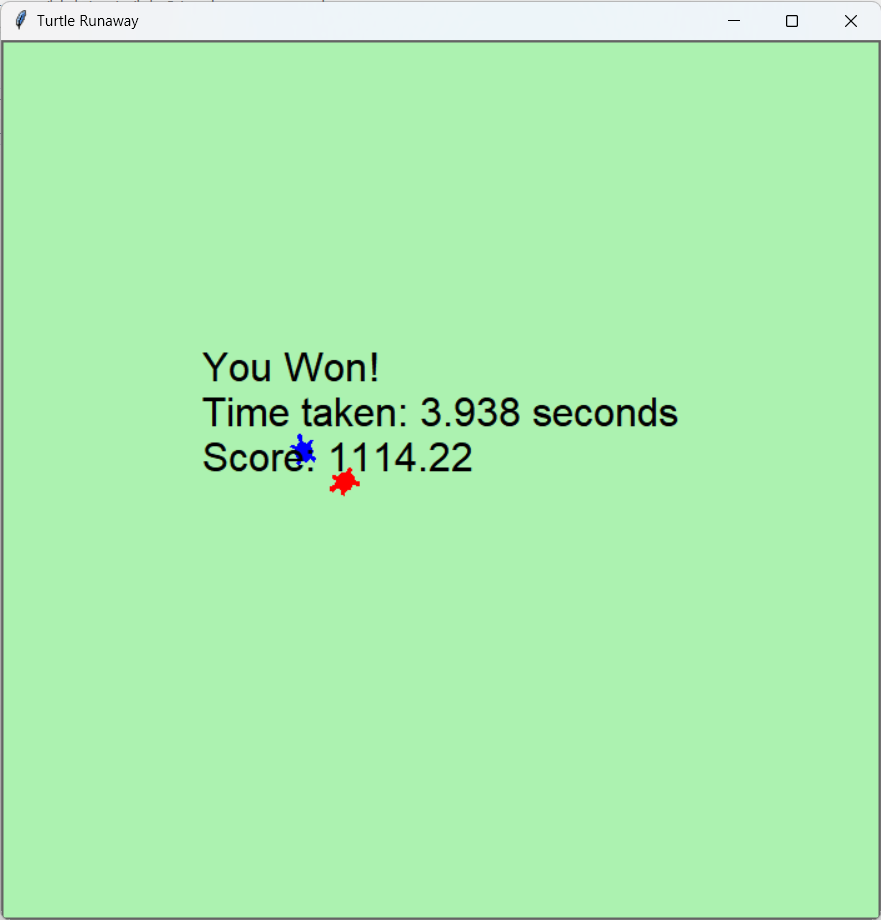

# Turtle Runner Game
>
> [!NOTE]
> Copyright 2024 - present [Ioannis Theodosiadis](mailto:ioannis@seoultech.ac.kr), SEOULTECH University
>
> This program is free software: you can redistribute it and/or modify
> it under the terms of the GNU General Public License as published by
> the Free Software Foundation, either version 3 of the License, or
> at your option any later version
>
> This program is distributed in the hope that it will be useful
> but WITHOUT ANY WARRANTY; without even the implied warranty of
> MERCHANTABILITY or FITNESS FOR A PARTICULAR PURPOSE.  See the
> GNU General Public License for more details
>
> You should have received a copy of the GNU General Public License
> along with this program. If not, see <https://www.gnu.org/licenses/>

## Overview

**Turtle Runaway** is a simple yet challenging game where the player controls a <span style="color:red">**chaser turtle**</span> and attempts to catch a computer-controlled <span style="color:blue">**runner turtle**</span>. The runner moves intelligently to avoid being caught, and the player's skill is measured by how efficiently they catch the runner, with a score based on both time and movement efficiency.



## How to Play

- You control the <span style="color:red">**chaser turtle**</span> in red using the arrow keys.
  - <code>&#8593;</code>: Move forward
  - <code>&#8595;</code>: Move backward
  - <code>&#8592;</code>: Turn left
  - <code>&#8594;</code>: Turn right
- The <span style="color:blue">**runner turtle**</span> in blue moves automatically and tries to escape from the chaser.
- Your goal is to catch the runner as quickly and efficiently as possible.

## Timeframe

- The game has a **15-second timeframe**.
- If the player does not catch the runner within this time limit, the game will end, and the player will lose.
- The time taken is also a key factor in determining the final score when the runner is caught.

## Scoring System

The score is calculated based on two main factors:

1. **Time Taken**: The faster you catch the runner, the higher your score.
2. **Movement Efficiency**: The less distance you move, the higher your score.

The formula for the score is as follows:

```math
Score = (1000 - time\_taken * 50) + (1000 - distance\_moved * 1.5)
```

> [!IMPORTANT]
>
> - `time_taken` is the time in seconds it took to catch the runner.
> - `distance_moved` is the total distance the player has moved while controlling the chaser turtle.

**Example**:

- If you catch the runner in 5 seconds and move a distance of 600 units, your score would be:

    ```math
    Score = (1000 - 5 *50) + (1000 - 600 * 1.5) = 1000 - 250 + 1000 - 900 = 850\ points
    ```

## Runner AI Explanation

The **runner turtle's AI** is designed to intelligently avoid being caught by the player. It follows these strategies:

1. **Orthogonal Escape**:

- When the chaser gets within a certain distance of the runner (set by `ESCAPE_DISTANCE`), the runner will move **perpendicularly** (either left or right) relative to the player's direction.
- This makes the runner harder to catch, as it doesn't always run directly away but instead moves sideways to gain distance.

2. **Continuous Random Movement**:

- When the chaser is far away, the runner moves continuously in a random direction, but within the boundaries of the game area.
- This ensures that the runner is always moving and doesn't stay in one place, making it harder for the chaser to predict its movement.

3. **Boundary Awareness**:

- The runner is aware of the game boundaries and will change direction to avoid moving off the screen. This ensures that the runner stays within the playable area.

4. **Cooldown Mechanism**:

- After performing an orthogonal escape, the runner continues moving in the same direction for a few steps (controlled by the `COOLDOWN_STEPS` variable) before resuming random movement. This prevents the runner from immediately reversing direction, making its movement more natural and challenging.

## How the Game Ends

- The game ends when either:
  - The player **catches** the runner.
  - **15 seconds** have passed without catching the runner, in which case the player loses.
- When the game ends, the final score is displayed along with the time it took to catch the runner.

## Customization

- **Runner Speed**: You can adjust the speed of the runner by changing the `step_move` parameter when creating the runner turtle. For example, increasing the value will make the runner move faster.
- **Game Timeframe**: You can adjust the total game time by modifying the `time_left` variable in the `RunawayGame` class.
- **Difficulty**: To make the game harder, you can lower the `ESCAPE_DISTANCE`, increase the runner's speed, or decrease the time allowed for catching the runner.

---

> Enjoy the game and see how high you can score!
