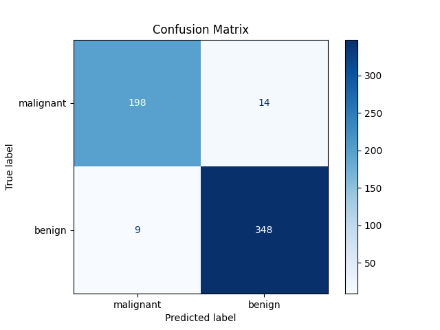

# ML Lab #1: Breast Cancer Classification
>
> [!NOTE]
> Copyright 2024 - present [Ioannis Theodosiadis](mailto:ioannis@seoultech.ac.kr), SEOULTECH University
>
> This program is free software: you can redistribute it and/or modify
> it under the terms of the GNU General Public License as published by
> the Free Software Foundation, either version 3 of the License, or
> at your option any later version
>
> This program is distributed in the hope that it will be useful
> but WITHOUT ANY WARRANTY; without even the implied warranty of
> MERCHANTABILITY or FITNESS FOR A PARTICULAR PURPOSE.  See the
> GNU General Public License for more details
>
> You should have received a copy of the GNU General Public License
> along with this program. If not, see <https://www.gnu.org/licenses/>

## Assignment

- Complete the following three missions using the given skeleton code (wdbc_classification_skeleton.py)
- Submit your code (wdbc_classification.py) and its two result images (wdbc_classification_scatter.png, wdbc_classification_matrix.png)

## Conditions

- Please follow the above filename convention.
- You **can** start from scratch (without using the given skeleton code).
  - However, you should use the given data.
- You **can** freely change the given skeleton code if necessary.

## How To Run It

Change into the lab-7 directory.

```PowerShell
cd lab-7
```

Run the Python script.

```PowerShell
python .\wdbc_classification.py
```

> [!IMPORTANT]
> The results are saved into the files [wdbc_classification_scatter.png](./wdbc_classification_scatter.png) and [wdbc_classification_matrix.png](./wdbc_classification_matrix.png).
> You will see the GUI open up for the diagramm. As soon as you close it, the picture is saved.

Here are the expected results:


